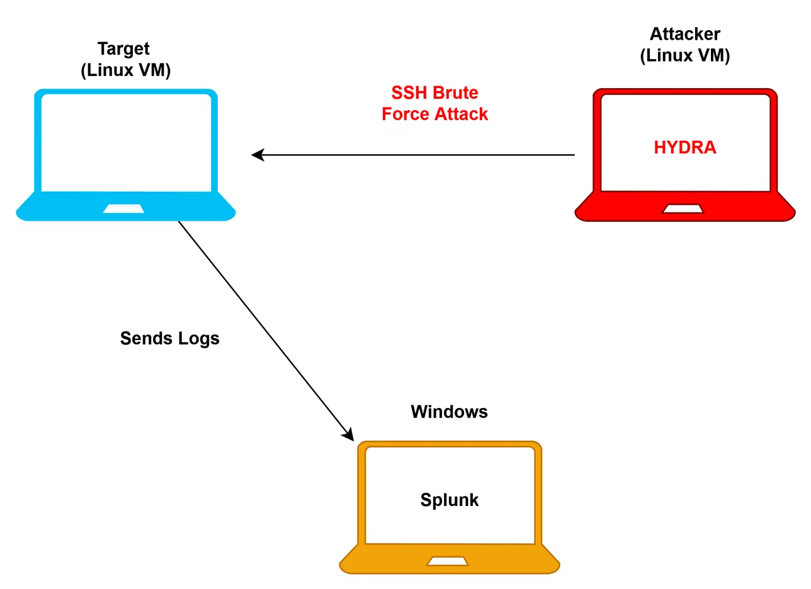
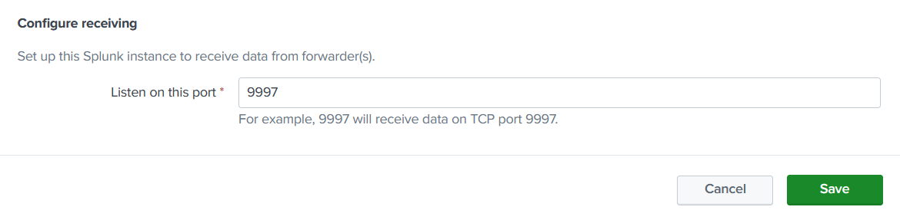
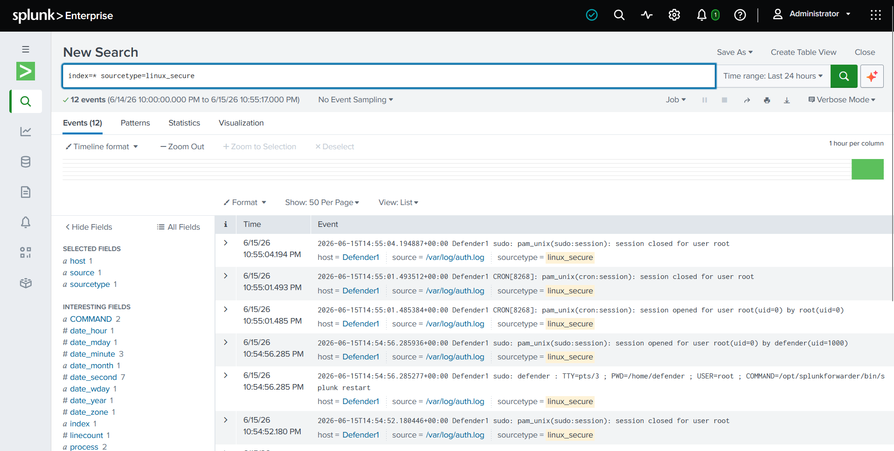
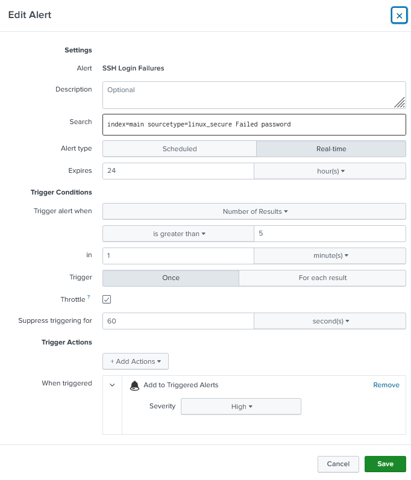
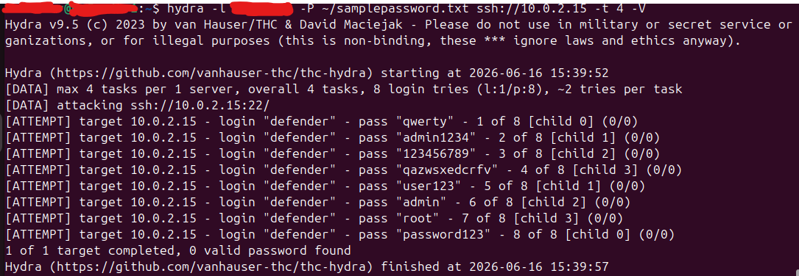
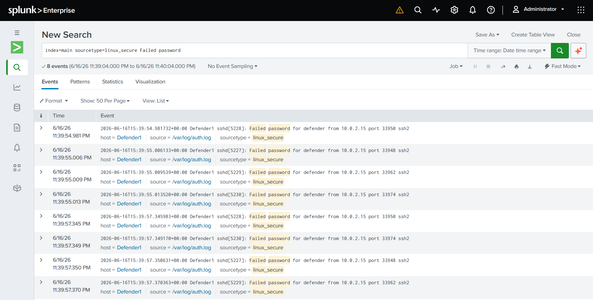

# 🛡️ SOC Detection Lab — SSH Brute-Force Attack Detection

A hands-on Security Operations Center (SOC) lab that simulates an SSH brute-force attack and detects it using **Splunk Enterprise** with log forwarding from a Linux VM.

---

## 📌 Overview

This project demonstrates a realistic blue-team workflow:

1. A Linux VM acts as the **target/log source**, running a port forwarder (Splunk Universal Forwarder or similar) to ship authentication logs to Splunk.
2. An SSH brute-force attack is **simulated** against the VM.
3. **Splunk Enterprise** ingests the logs and is used to detect the attack through searches, dashboards, and alerts.

---

## 🧰 Tools & Stack

| Component | Role |
|---|---|
| **Splunk Enterprise** | SIEM — log ingestion, search, alerting |
| **Linux VM** | Attack target / log source |
| **Port Forwarder** | Ships `/var/log/auth.log` to Splunk |
| **Hydra / Manual** | SSH brute-force simulation tool |

---

## 🔧 Lab Setup



In this lab, I used 1 PC and 2 VMs. One of my VMs is the target and the other is the attacker.

The attacker brute forces into the target. Then the target VM sends to my PC the logs.

So to setup this lab, I have to make sure that my PC and the target VM can communicate and the target VM can send logs.




After that I also added a forward server inside the VM so the two can finally connect.

To verify, 



Then I configured my alert trigger.



```spl
index=main sourcetype=linux_secure Failed password
| where count > 5
```

---

## 🔴 Attack

Using Hydra, I can stage a simple brute force attack to my target VM



---

## 🔍 Detection

As the attacks were carried by the Attacker VM. It was detected by splunk, thus sending us an alert.





## 📚 References

- [Splunk Universal Forwarder Docs](https://docs.splunk.com/Documentation/Forwarder)
- [Splunk Search Reference](https://docs.splunk.com/Documentation/Splunk/latest/SearchReference)
- [MITRE ATT&CK — Brute Force (T1110)](https://attack.mitre.org/techniques/T1110/)

---

## ⚠️ Disclaimer

This lab is for **educational purposes only**. All attacks were performed in an isolated, controlled lab environment. Never perform brute-force attacks against systems you do not own or have explicit permission to test.

---

*Built as a hands-on learning project for SOC analysis.*
